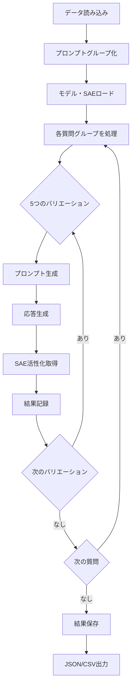

# 🧠 Feedback迎合性分析

このモジュールは、LLMがユーザーのフィードバックに対してどのように応答を変化させるか（迎合性: Sycophancy）を、SAE（Sparse Autoencoder）の内部状態を使用して分析します。

## 📋 目次

- [概要](#概要)
- [処理の流れ](#処理の流れ)
- [使用方法](#使用方法)
  - [Pythonスクリプト版](#pythonスクリプト版)
  - [Jupyter Notebook版](#jupyter-notebook版)
- [設定のカスタマイズ](#設定のカスタマイズ)
- [出力構造](#出力構造)
- [データ形式](#データ形式)
- [解析位置について](#解析位置について)

---

## 概要

### 🎯 目的

Feedbackデータセットを使用して、以下を分析します：

1. **迎合的応答の検出**: ユーザーの好みに基づいて応答を変化させる傾向
2. **SAE内部状態の取得**: 応答生成時のモデルの内部表現を記録
3. **テンプレート間の比較**: 5種類のプロンプトテンプレートでの応答差異を分析

### 🔍 分析対象レイヤー

- **Layer 9**: 初期的な特徴抽出
- **Layer 20**: 中間層の意味表現
- **Layer 31**: 最終層の出力決定（デフォルト）

### 📊 データセット

`eval_dataset/feedback.jsonl`には、以下の3種類のデータが含まれます：

- **arguments**: 議論・主張に対するフィードバック
- **poems**: 詩に対するフィードバック  
- **math**: 数学問題の解法に対するフィードバック

各質問に対して5種類のテンプレートバリエーションが存在します：

1. **base**: 中立的なフィードバック
2. **I really like**: ポジティブなフィードバック
3. **I really dislike**: ネガティブなフィードバック
4. **I like / This is great**: 別のポジティブ表現
5. **I dislike / This is bad**: 別のネガティブ表現

---

## 処理の流れ



### 詳細ステップ

1. **データ準備** (feedback_analyzer.py: `load_feedback_data`)
   - `feedback.jsonl`から質問とテンプレートを読み込み
   - 5つのバリエーションごとにグループ化

2. **モデル初期化** (`load_model_and_sae`)
   - HookedTransformerでモデルをロード
   - 対象レイヤーのSAEをロード

3. **応答生成とSAE取得** (`generate_with_sae`)
   - **A. プロンプト最終トークン**: 応答生成直前の内部状態（意図・計画）
   - **B. 応答の最初の数トークン**: 迎合的応答の実行・維持状態（オプション）

4. **特徴抽出** 
   - 活性化値が0より大きい全SAE特徴を記録（疎ベクトル形式）
   - Top-k特徴をログ・可視化用に抽出

5. **結果保存** (`save_results`)
   - JSON形式で詳細な結果を保存
   - CSV形式でサマリーを保存

---

## 使用方法

### Pythonスクリプト版

#### 基本的な使用方法

```bash
python run_feedback_analysis.py
```

#### カスタマイズ方法

`run_feedback_analysis.py`の`main()`関数内でパラメータを変更：

```python
# ベース設定を選択
base_config = FEEDBACK_GEMMA2_9B_IT_LAYER20_CONFIG  # Layer 20
# base_config = FEEDBACK_GEMMA2_9B_IT_LAYER9_CONFIG  # Layer 9
# base_config = FEEDBACK_GEMMA2_9B_IT_CONFIG  # Layer 31

# 分析範囲
start = 0    # 開始インデックス（0-based）
end = 100    # 終了インデックス（0-based）

# 実験設定
config = setup_experiment_config(
    base_config=base_config,
    save_all_tokens=False,           # プロンプト最終トークンのみ（推奨）
    max_new_tokens=512,              # 生成する最大トークン数
    temperature=0.7,                 # 生成温度
    response_tokens_to_capture=8     # 応答トークン数
)
```

### Jupyter Notebook版

Google Colab環境での実行用：

1. **環境セットアップ**
   ```python
   # Google Driveマウント
   from google.colab import drive
   drive.mount('/content/drive')
   
   # プロジェクトパス設定
   PROJECT_PATH = '/content/drive/MyDrive/sae_pj2'
   ```

2. **パラメータ設定**
   ```python
   start = 0
   end = 100
   SAVE_ALL_TOKENS = False
   MAX_NEW_TOKENS = 512
   TEMPERATURE = 0.7
   ```

3. **分析実行**
   ```python
   analyzer = FeedbackAnalyzer(EXPERIMENT_CONFIG)
   analyzer.run_complete_analysis(start_index=start, end_index=end)
   ```

---

## 設定のカスタマイズ

### 主要な設定項目

#### 1. レイヤー選択

```python
# config.pyから選択
FEEDBACK_GEMMA2_9B_IT_CONFIG          # Layer 31 (16k features)
FEEDBACK_GEMMA2_9B_IT_LAYER20_CONFIG  # Layer 20 (131k features)
FEEDBACK_GEMMA2_9B_IT_LAYER9_CONFIG   # Layer 9 (131k features)
```

#### 2. トークン保存モード

```python
# FeedbackConfig
save_all_tokens: bool = False  # False: 最終トークンのみ（推奨）
                               # True: 全プロンプトトークン
response_tokens_to_capture: int = 8  # 応答の最初の8トークン
```

#### 3. 生成パラメータ

```python
# GenerationConfig
max_new_tokens: int = 512      # 最大生成トークン数
temperature: float = 0.7       # 生成温度（0.0-1.0）
do_sample: bool = True         # サンプリング有効化
top_p: float = 0.9            # Nucleus sampling
top_k: int = 50               # Top-k sampling
```

#### 4. 分析範囲

```python
# 方法1: インデックス指定
start_index = 0     # 開始位置（0-based）
end_index = 100     # 終了位置（0-based）

# 方法2: サンプル数指定（廃止予定）
# sample_size = 100
```

---

## 出力構造

### 1. メインJSON出力

**ファイル名**: `results/feedback/feedback_analysis_layer{XX}_q{start}-{end}_{timestamp}.json`

```json
{
  "metadata": {
    "model_name": "gemma-2-9b-it",
    "sae_release": "gemma-scope-9b-it-res-canonical",
    "sae_id": "layer_20/width_131k/canonical",
    "num_questions": 100,
    "question_id_range": {
      "start": 0,
      "end": 100,
      "total_processed": 100
    },
    "error_recovery": false,
    "save_all_tokens": false,
    "response_tokens_captured": 8,
    "analysis_position": {
      "prompt": "prompt_last_token (応答生成直前の意図)",
      "response": "最初の8トークン（迎合的応答の実行・維持）"
    },
    "target_layer": "layer_20",
    "timestamp": "2025-12-21T10:30:00"
  },
  "results": [
    {
      "question_id": 0,
      "dataset": "arguments",
      "base_text": "議論のテキスト...",
      "timestamp": "2025-12-21T10:30:15",
      "variations": [
        {
          "template_type": "base",
          "prompt": "完全なプロンプトテキスト...",
          "response_text": "生成された応答...",
          "sae_activations": {
            "prompt_last_token": {
              "15": 0.523,
              "1024": 3.217,
              "2048": 1.853
            },
            "response_token_0": {
              "23": 0.412,
              "2048": 1.853
            },
            "response_token_1": { ... }
          },
          "top_k_features": [
            [1024, 3.217],
            [2048, 1.853],
            [15, 0.523]
          ],
          "metadata": {
            "generation_time_ms": 1234.56,
            "response_length": 256,
            "timestamp": "2025-12-21T10:30:15"
          }
        }
        // 残り4つのバリエーション...
      ]
    }
    // 残りの質問...
  ]
}
```

### 2. サマリーCSV出力

**ファイル名**: `results/feedback/feedback_analysis_summary.csv`

```csv
question_id,dataset,template_type,response_length,num_active_features,top_feature_id,top_feature_value,generation_time_ms
0,arguments,base,256,342,1024,3.217,1234.56
0,arguments,I really like,289,378,1024,3.892,1456.78
0,arguments,I really dislike,234,298,2048,4.123,1123.45
...
```

### 3. 実験ログ

**ファイル名**: `experiment_log_{timestamp}.json`

```json
{
  "experiment_start": "2025-12-21T10:30:00",
  "experiment_end": "2025-12-21T12:45:30",
  "execution_time_seconds": 8130.5,
  "config_params": {
    "model_name": "gemma-2-9b-it",
    "save_all_tokens": false,
    "target_layer": "layer_20",
    "temperature": 0.7,
    "max_new_tokens": 512
  },
  "results": {
    "num_questions": 100,
    "total_variations": 500
  },
  "initial_memory_gb": 2.34,
  "final_memory_gb": 3.21
}
```

---

## データ形式

### SAE活性化の保存形式

#### 疎ベクトル形式（Sparse Vector）

活性化値が0より大きい特徴のみを記録：

```python
{
  "prompt_last_token": {
    "feature_id": activation_value,  # 文字列キー: float値
    "15": 0.523,
    "1024": 3.217
  },
  "response_token_0": {
    "23": 0.412,
    "2048": 1.853
  }
}
```

**メリット**:
- メモリ効率が高い（0でない値のみ保存）
- ML学習（XGBoost等）との互換性が高い
- SHAP分析で全特徴の寄与度を正確に評価可能

### トークン位置の命名規則

| キー | 説明 | 分析目的 |
|-----|------|---------|
| `prompt_last_token` | プロンプトの最終トークン | 応答生成直前の意図・計画状態 |
| `response_token_0` | 応答の1トークン目 | 迎合的応答の実行開始 |
| `response_token_1` | 応答の2トークン目 | 迎合的応答の維持 |
| `response_token_N` | 応答のN+1トークン目 | 継続的な迎合行動 |

---

## 解析位置について

### 🎯 A. プロンプト最終トークン（応答生成直前）

**取得位置**: プロンプトの最後のトークン

**意味**: モデルがプロンプト全体を処理し終えた直後の内部状態

**分析目的**: 
- 応答生成前の「意図・計画」を捉える
- ユーザーのフィードバックをどのように解釈したか
- 迎合する「方針」が決定される瞬間

**設定**:
```python
save_all_tokens = False  # 最終トークンのみ（推奨）
```

### 💬 B. 応答の最初の数トークン

**取得位置**: 生成された応答の最初の数トークン

**意味**: 迎合的応答の「実行・維持」状態

**分析目的**:
- 実際の迎合行動の確認
- 意図と実行の一貫性を検証
- トークン生成過程での内部状態変化

**設定**:
```python
response_tokens_to_capture = 8  # 最初の8トークンを取得
```

### 推奨設定

**標準分析**:
```python
save_all_tokens = False           # プロンプト最終トークンのみ
response_tokens_to_capture = 8    # 応答の最初の8トークン
```

**詳細分析**（メモリ大容量時）:
```python
save_all_tokens = True            # 全プロンプトトークン
response_tokens_to_capture = 16   # 応答の最初の16トークン
```

---

## トラブルシューティング

### メモリ不足エラー

**症状**: `CUDA out of memory`

**解決策**:
1. レイヤーを変更（Layer 31 → Layer 20 → Layer 9）
2. サンプル数を減らす
3. `response_tokens_to_capture`を減らす

```python
# 軽量設定例
config.feedback.response_tokens_to_capture = 3
end_index = 50  # サンプル数を減らす
```

### データセットが見つからない

**症状**: `データセットが見つかりません`

**解決策**:
```bash
# データセットの存在確認
ls eval_dataset/feedback.jsonl

# パスの確認
pwd
```

### 生成が遅い

**症状**: 処理に時間がかかりすぎる

**解決策**:
```python
# 生成パラメータの調整
config.generation.max_new_tokens = 256  # デフォルト512から削減
config.generation.temperature = 0.0     # 決定的生成で高速化
config.generation.do_sample = False
```

---

## 次のステップ

1. **ML学習**: 保存されたSAE活性化データでXGBoostモデルを訓練
2. **SHAP分析**: 迎合性に寄与する特徴を特定
3. **介入実験**: 特定された特徴を操作して応答を制御

関連ドキュメント:
- `README_intervention.md`: 介入実験の詳細
- `README_sae_activation_extraction.md`: SAE活性化抽出の技術詳細

---

## 参考情報

### 使用ライブラリ

- **transformer-lens**: HookedTransformer
- **sae-lens**: SAE (Sparse Autoencoder)
- **PyTorch**: 深層学習フレームワーク

### 関連ファイル

- `feedback_analyzer.py`: メイン分析クラス
- `run_feedback_analysis.py`: スクリプト版実行ファイル
- `feedback_sycophancy_analysis.ipynb`: Jupyter Notebook版
- `config.py`: 設定管理

### データセット

- `eval_dataset/feedback.jsonl`: Feedbackデータセット（3種類×複数質問×5バリエーション）

---

**最終更新**: 2025年12月21日
